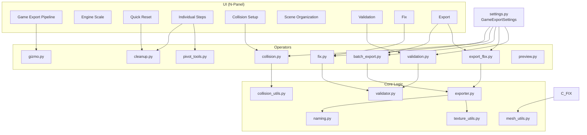
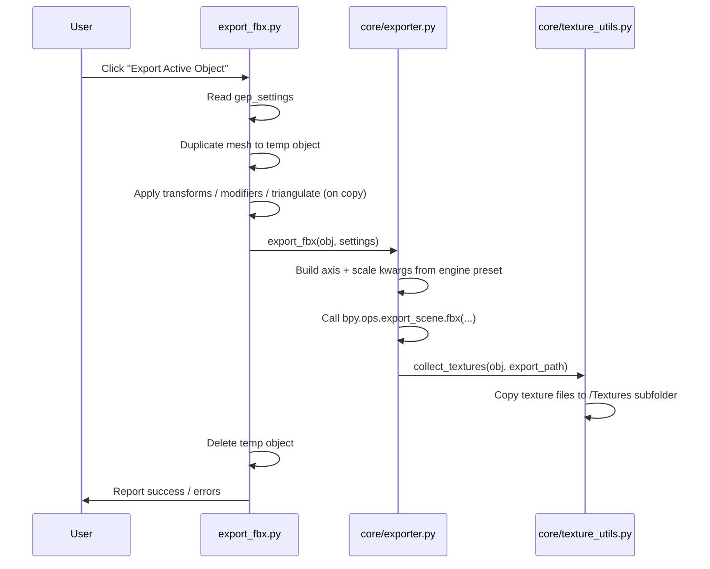
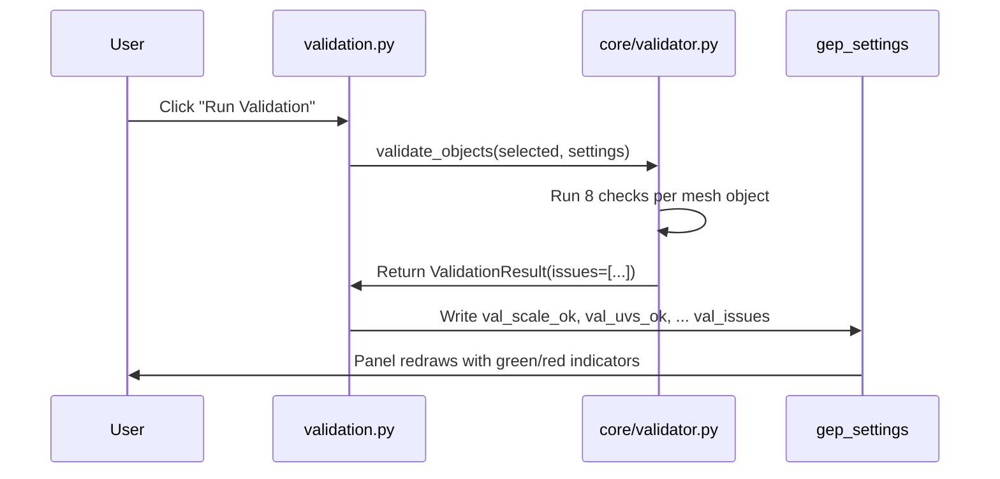

# Architecture

Game Export Pipeline is a Blender addon built around a clean separation between **settings**, **operators**, and **core logic**. This page explains how the pieces fit together — useful if you want to extend the addon or integrate it into a studio pipeline.

---

## Module overview

---

## Settings (`settings.py`)

All user-facing settings are stored in a single `GameExportSettings` `PropertyGroup` attached to `bpy.types.Scene` as `scene.gep_settings`. This means every setting is per-scene and saved in the `.blend` file automatically.

Settings are grouped into logical categories:

| Category | Key properties |
|---|---|
| Output | `export_path`, `use_meshes_subfolder` |
| Engine | `engine_preset`, `custom_axis_forward`, `custom_axis_up`, `custom_scale` |
| Naming | `prefix` |
| Cleanup | `apply_transforms`, `apply_modifiers`, `triangulate`, `remove_empties` |
| Collision | `collision_decimate`, `collision_as_children` |
| Textures | `collect_textures`, `rename_textures`, `use_collection_catalog` |
| Validation thresholds | `poly_warn_threshold`, `texture_size_warn` |
| Viewport helpers | `show_forward_gizmo`, `show_scale_ref` |
| Validation state | `val_ran`, `val_scale_ok`, `val_uvs_ok`, … `val_issues` |

Validation state properties are written by the Validate operator and read by the UI panel to draw the result indicators — the panel itself contains no validation logic.

---

## Operators (`operators/`)

Each operator file registers one or more `bpy.types.Operator` subclasses. Operators are thin: they read settings from `context.scene.gep_settings`, call the appropriate core function, and report results back to Blender via `self.report()`.

| File | Responsibility |
|---|---|
| `validation.py` | Calls `core.validator.validate_objects()`, writes results back to settings |
| `export_fbx.py` | Single-object FBX export with pre-export cleanup on a temporary copy |
| `batch_export.py` | Iterates selected objects and calls export for each |
| `collision.py` | Convex hull and bounding box generation; remove all collision |
| `pivot_tools.py` | Pivot-to-bottom, pivot-to-center operators |
| `cleanup.py` | Apply transforms, apply modifiers, triangulate, lightmap UV |
| `fix.py` | Individual fix operators + Fix All; delegates to `core` utilities |
| `gizmo.py` | Forward axis arrow and scale reference box draw handlers |
| `preview.py` | Export preview utilities |

---

## Core logic (`core/`)

The `core/` package contains pure Python / bmesh logic with no `bpy.ops` calls. This makes it testable outside the Blender UI and easy to call from multiple operators without duplication.

| Module | Responsibility |
|---|---|
| `validator.py` | Runs all eight validation checks and returns a `ValidationResult` with a list of `Issue` dataclass instances |
| `exporter.py` | Builds the FBX export call with the correct axis/scale settings for the active engine preset; handles texture collection |
| `collision_utils.py` | Convex hull and bounding box generation, decimate, naming |
| `mesh_utils.py` | Fill holes, triangulate, remove loose verts and zero-area faces |
| `texture_utils.py` | Collect textures to subfolder, optional rename to `AssetName_TextureType` convention |
| `naming.py` | Prefix application, default name detection, safe-character enforcement |

---

## Data flow: Export

The original scene object is never modified during export — all cleanup (apply transforms, triangulate, etc.) is performed on a temporary duplicate that is deleted immediately after the FBX is written.

---

## Data flow: Validation

Validation is read-only — it never modifies scene data. The `core/validator.py` module uses `bmesh` for mesh inspection and standard Python for all other checks.
